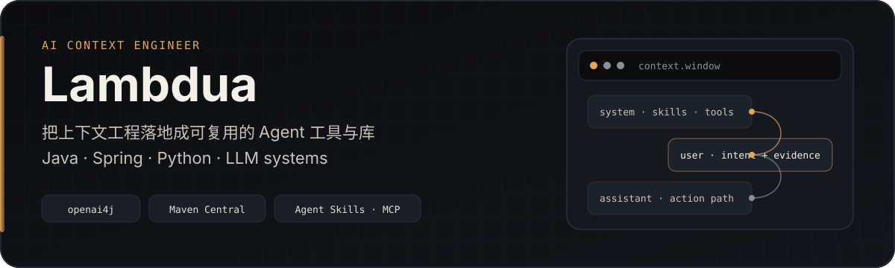
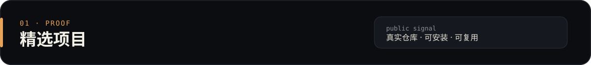
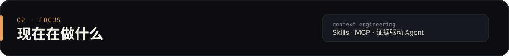
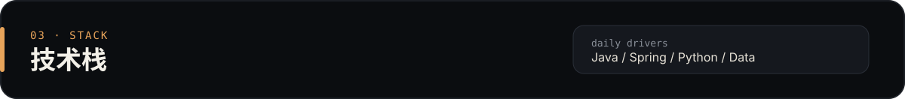

<p align="center">
  
</p>

<p align="center">
  <a href="https://github.com/Lambdua/openai4j"></a>
  <a href="https://central.sonatype.com/search?q=io.github.lambdua"></a>
  
  
</p>

---

我是 **Lambdua**，一名偏工程落地的 **AI Context Engineer**。

主要做两件事：

1. 把 LLM / Agent 能力做成 **可安装、可组合、可维护** 的库与服务  
2. 用证据与上下文窗口设计，减少“能聊但不可用”的 Agent 系统

---

<p align="center">
  
</p>

### [openai4j](https://github.com/Lambdua/openai4j) · Java OpenAI client

非官方但持续维护的 Java OpenAI 客户端（Maven Central：`io.github.lambdua`）。星数以仓库页与上方 badge 为准。

- 覆盖 Chat / Completions / Embeddings / Audio / Images / Moderations / Batch / Fine-tuning  
- Assistants v2、Tools / Function calling、同步与流式调用  
- Retrofit + 环境变量配置，适合直接嵌进 Spring / 后端服务

```xml
<dependency>
  <groupId>io.github.lambdua</groupId>
  <artifactId>service</artifactId>
  <version>0.22.92</version>
</dependency>
```

### 其他公开仓库

| 仓库 | 说明 |
| --- | --- |
| [ecloud-wechat-java-sdk](https://github.com/Lambdua/ecloud-wechat-java-sdk) | e 云管家微信 API 的 Java SDK |
| [JavaAll](https://github.com/Lambdua/JavaAll) / [SpringBootAll](https://github.com/Lambdua/SpringBootAll) | 日常学习、demo 与源码阅读笔记 |

---

<p align="center">
  
</p>

当前主线：**Agent Skills + MCP 数据服务**，把“检索 / 证据 / 工具调用 / 审计”串成可部署链路。

关注点：

- **Context Engineering**：系统提示、技能包、工具面、证据分级如何一起工作  
- **可运维性**：OAuth、审计、双环境、真实上游依赖，而不是 demo-only 脚本  
- **合规边界**：优先官方 API；无官方时用可控浏览器通道；不碰逆向签与抢票类红线

---

<p align="center">
  
</p>

**语言与框架**

`Java` · `Spring` · `Python` · `TypeScript`（按需）

**数据与消息**

`MySQL` · `MongoDB` · `Redis` · `MQ`

**AI / Agent**

`OpenAI API` · `LLM client libraries` · `Agent Skills` · `MCP`

**工程习惯**

证据优先 · 可部署 · 少写死会变的数据 · 文档只保留现行结论

---

### 活动与语言分布

<p align="center">
  
  
</p>

<p align="center">
  <picture>
    <source media="(prefers-color-scheme: dark)" srcset="https://raw.githubusercontent.com/Lambdua/Lambdua/output/github-contribution-grid-snake-dark.svg">
    <source media="(prefers-color-scheme: light)" srcset="https://raw.githubusercontent.com/Lambdua/Lambdua/output/github-contribution-grid-snake.svg">
    
  </picture>
</p>

---

<p align="center">
  想一起做 Agent 基础设施、Java LLM 集成或出行/垂直域 Skills？欢迎直接开 Issue 或通过仓库联系。
</p>

<p align="center">
  <a href="https://github.com/oil-oil/beautify-github-readme"></a>
</p>
